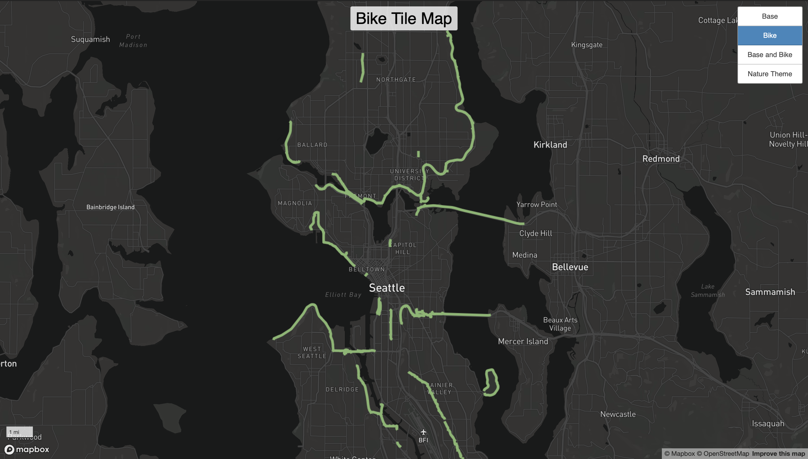

# BikeTileMap
The area of focus for my tile map is Seattle,Washington. I focused on making a map that highlighted bike trails and green space in the city. All of the tiles have a 3-14 zoom level available for the map user. My map includes four different tiles. The first is the base tile which has a white monochrome layer meant to make the bike tile stand out. The Bike tile uses data from the Seattle GeoData website. I increased the width of the biking trails and changed it to a lime green color in order to increase readability. The third tile combines the Bike and base tiles together.The Last tile is the nature tile. I wanted to continue the theme of outdoors activies by highlighting the greenspaces in the city. I made the parks and green spaces a deep green color to make it easy to identify from a high zoom level. 

Link to Map: [link](https://sirwillphil.github.io/BikeTileMap/)  
Data Source: [Seattle GeoData](https://data-seattlecitygis.opendata.arcgis.com/maps/bf36bd11b499489d8cc1d491b72eb712/about)  

Screenshots

